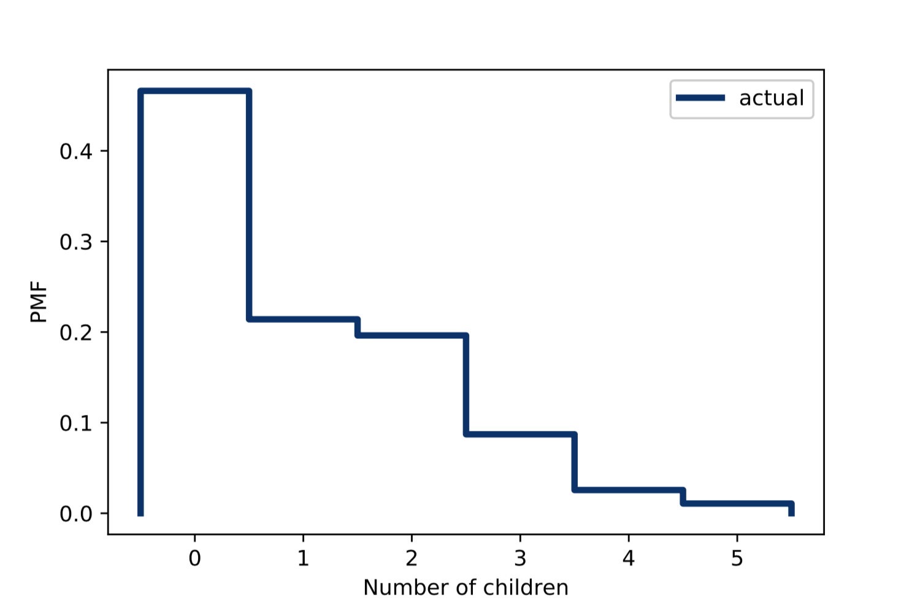
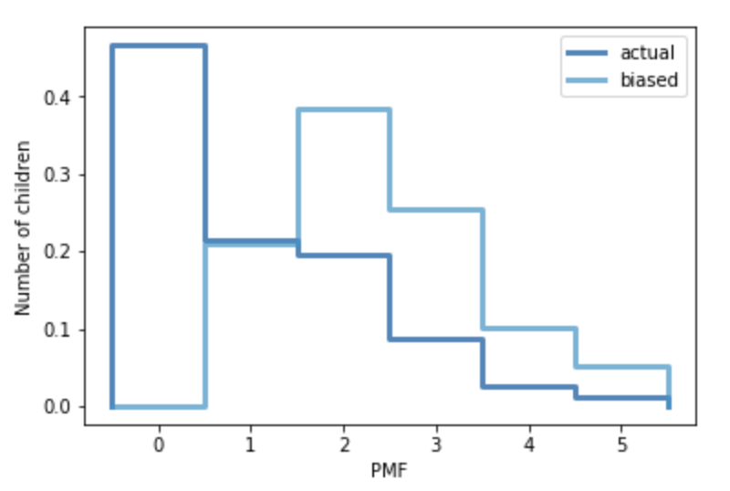

[Think Stats Chapter 3 Exercise 1](http://greenteapress.com/thinkstats2/html/thinkstats2004.html#toc31) (actual vs. biased)

```python
resp = nsfg.ReadFemResp()  
pmf = thinkstats2.Pmf(resp.numkdhh, label='actual')  
```
```python
# plot number of children per house  
# actual distribution of number of children per family  
thinkplot.Pmf(pmf, label='actual')
thinkplot.Config(xlabel='Number of children', ylabel='PMF')
# thinkplot.Save(root='1')
```

```python
# calculate biased distribution
biased = BiasPmf(pmf, 'biased')

#plot biased and actual data together
thinkplot.PrePlot(2)
thinkplot.Pmfs([pmf, biased])
thinkplot.Show(xlabel='PMF', ylabel='Number of children')
# thinkplot.Save(root='2')
```

```python
#compare means from biased and real data
print(pmf.Mean(), biased.Mean())
```
```
1.02420515504 2.40367910066
```
In this exercise, we can see the effect of the 'class size paradox'.  
If we interview a group of people and ask them how many children their parents have, we would have a biased conclusion of the mean, and therefore, a biased data collection.  
To avoid this kind of misinterpretation, we need to make sure that the data we are using in a study was collected right.  
