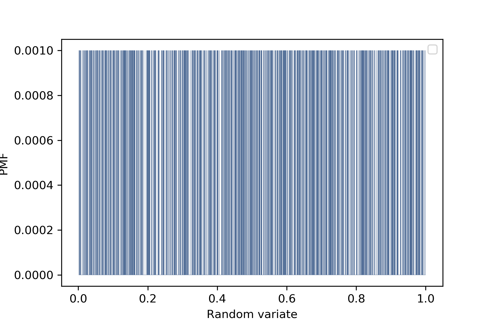
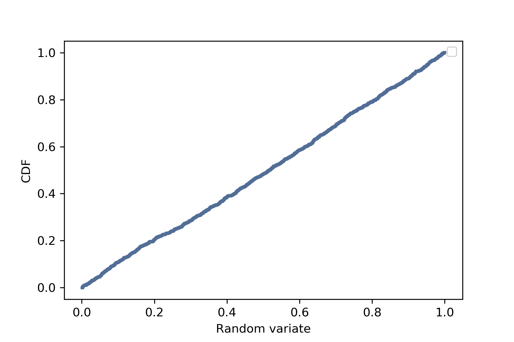

[Think Stats Chapter 4 Exercise 2](http://greenteapress.com/thinkstats2/html/thinkstats2005.html#toc41) (a random distribution)

```python
sample = np.random.random(1000)
pmf = thinkstats2.Pmf(sample)
thinkplot.Pmf(pmf, linewidth=0.2)
thinkplot.Config(xlabel='Random variate', ylabel='PMF')
thinkplot.Save('4-1', formats=['png'])
```

```python
cdf = thinkstats2.Cdf(sample)
thinkplot.Cdf(cdf)
thinkplot.Config(xlabel='Random variate', ylabel='CDF')
thinkplot.Save('4-2', formats=['png'])
```


When we generate a sample with random values, the probability of each value appear in the sample is equal to other values probability -- every value have the same probability to be in the sample.  
The CDF is approximately a straight line, therefore, the distribution is uniform.  
