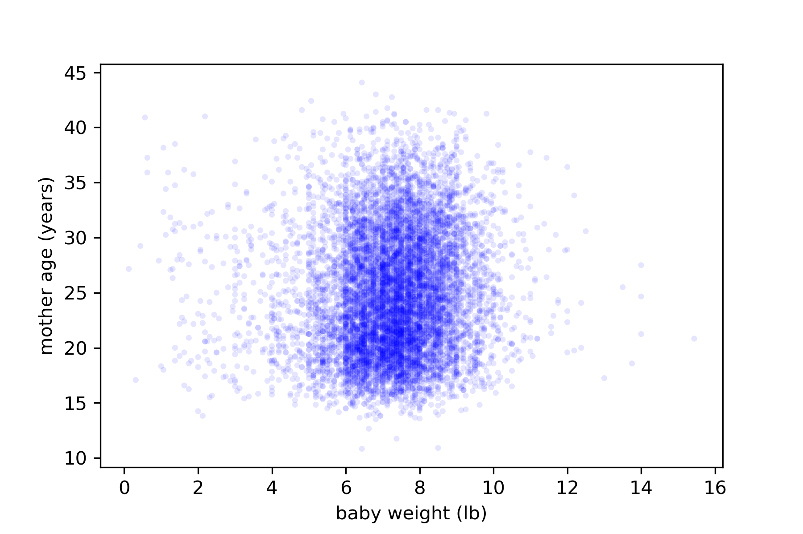

[Think Stats Chapter 7 Exercise 1](http://greenteapress.com/thinkstats2/html/thinkstats2008.html#toc70) (weight vs. age)

```python
# importing required data and packages
import nsfg
preg = nsfg.ReadFemPreg()
live = preg[preg.outcome == 1].dropna(subset=['agepreg', 'totalwgt_lb'])
```
```python
#create required variables to analyze correlations
baby_weight = live.totalwgt_lb
mother_age = live.agepreg
```
```python
#make a scatter plot to visualize the correlation between variables
thinkplot.Scatter(baby_weight, mother_age, alpha=0.1, s=10)
thinkplot.Config(xlabel='baby weight (lb)',
                ylabel='mother age (years)')
# thinkplot.Save(root='7-scatter', formats=['png'])
```

```python
#Pearson's correlation function
def Corr(xs, ys):
    xs = np.asarray(xs)
    ys = np.asarray(ys)

    meanx, varx = thinkstats2.MeanVar(xs)
    meany, vary = thinkstats2.MeanVar(ys)

    corr = Cov(xs, ys, meanx, meany) / np.sqrt(varx * vary)
    return corr
  ```
  ```python
  # Compute Pearson's Correlation
pearson = Corr(baby_weight, mother_age)
pearson
```
0.0688339703541091
```python
# Spearman correlation function
import pandas as pd
def SpearmanCorr(xs, ys):
    xranks = pd.Series(xs).rank()
    yranks = pd.Series(ys).rank()
    return Corr(xranks, yranks)
```
```python
# Compute Spearman's correlation
spearman = SpearmanCorr(baby_weight, mother_age)
spearman
```  
0.09461004109658226

**Conclusions**
In the above analysis, it was clear that the Pearson correlation (0.068) was lower than the Spearman rank correlation (0.094), as seen in the book, this could be caused for many reasons.  
We can see in the scatter plot, that there are some outliers in the data set, and this can affect the Pearson correlation coefficient.  
